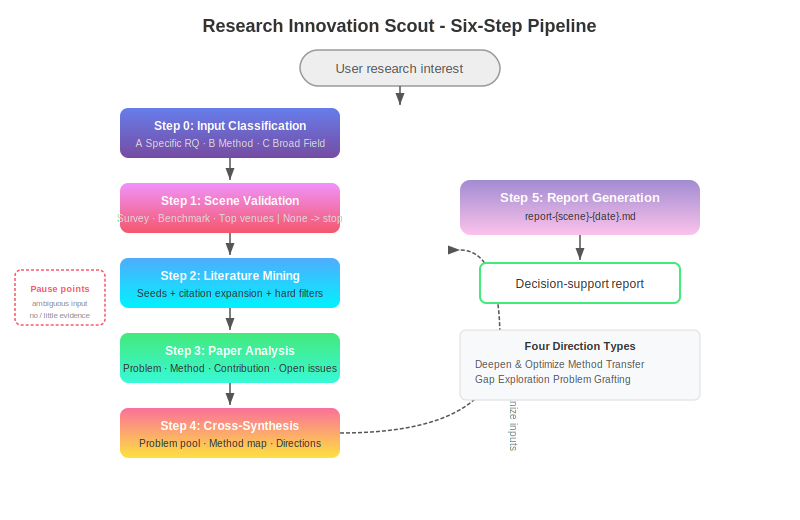

# 🔬 Research Innovation Scout

> From vague research ideas to literature-anchored innovation directions — turn "I have a rough direction" into "I have N paper-backed optional topics".

<p align="center">
  
  
  
  
  
</p>

<p align="center">
  
</p>

> 📖 [中文版 / Chinese](./README_zh-CN.md)

---

## 🚀 What is this?

Research Innovation Scout is a **discipline-agnostic framework for discovering research innovation directions**. Feed it a vague research interest (a domain, a technique, a keyword, a paper DOI), and it executes a six-step pipeline to output a decision-support report with literature-anchored innovation suggestions.

### vs. Generic AI Prompts

| | Generic Prompts | Research Innovation Scout |
|--|-----------------|--------------------------|
| Starting point | "Find me some ideas" | Input classification + problem formulation |
| Evidence | Fabricates from memory | Every step searches real literature |
| Analysis | Surface-level | Four-dimension breakdown + explicit/inferred separation |
| Directions | Random list | Four types + literature anchors + risk/feasibility |
| Edge cases | Makes things up | Cold → clearly states "no evidence"; Hot → overflow truncation |

Every step is an independent, reusable AI prompt with anti-hallucination design — **if no evidence exists, it says so clearly. Never fabricates.**

---

## ⚡ Quick Start

### Option 1: One-Click Install (Recommended)

```bash
git clone https://github.com/LPK3215/research-opportunity-finder.git
cd research-opportunity-finder
./scripts/install.sh          # Auto-detect your tools and install
```

### Option 2: Install for a Specific Tool

```bash
./scripts/install.sh --tool claude-code   # Claude Code
./scripts/install.sh --tool codex        # Codex / OpenAI Skill
./scripts/install.sh --tool cursor        # Cursor
./scripts/install.sh --tool codebuddy     # CodeBuddy compatibility
./scripts/install.sh --tool copilot       # GitHub Copilot
./scripts/install.sh --tool aider         # Aider
./scripts/install.sh --tool windsurf       # Windsurf
./scripts/install.sh --tool general       # Plain Markdown
```

Language-specific install:

```bash
./scripts/install.sh --lang en             # English prompt bundle
./scripts/install.sh --lang zh-CN          # Chinese prompt bundle
```

### Option 3: Manual Use

Send the contents of `skills/en/research-innovation-scout.md` to any AI that supports file reading and web search. Chinese users can use `skills/zh-CN/research-innovation-scout.md`. Then input your research interest.

```bash
# Claude Code users: the project skill is available after cloning
claude
# Just say: "Find innovation directions for contrastive learning in molecular property prediction"
```

---

## 🔌 Multi-Tool Integrations

Research Innovation Scout is designed first for Claude Code, Codex/OpenAI Skills, and Cursor:

| Primary Tool | Install Location | How to Use |
|------|-----------------|------------|
| **Claude Code** | `.claude/skills/research-innovation-scout/` | Ask naturally; Claude invokes the Skill when relevant |
| **Codex / OpenAI Skill** | `$CODEX_HOME/skills/research-innovation-scout/` | Ask Codex to use `$research-innovation-scout` |
| **Cursor** | `.cursor/rules/research-innovation-scout.mdc` | Use `@research-innovation-scout <direction>` |

Compatibility targets are also available:

| Tool | Install Location | How to Use |
|------|-----------------|------------|
| **CodeBuddy** | `.codebuddy/skills/research-innovation-scout/` | Auto-detected as a Skill |
| **GitHub Copilot** | `.github/agents/research-innovation-scout.md` | Project prompt |
| **Aider** | `CONVENTIONS.md` | Auto-read on `aider` launch |
| **Windsurf** | `.windsurfrules` | Auto-loaded by Cascade |
| **Plain Markdown** | `research-innovation-scout/` | Send to any AI |

### Usage Example

```
👤 User: Find innovation directions for diffusion models in materials design

🤖 Framework:
  Step 0: Input Classification → Type A, auto-advance
  Step 1: Scene Validation → 🟢 Strong evidence (survey + benchmark + top venues)
  Step 2: Literature Mining → 18 core papers
  Step 3-4: Paper Analysis + Cross-Synthesis → 5 innovation directions
  Step 5: Report Generation → 📄 report-diffusion-materials-*.md
```

---

## 🏗️ Six-Step Pipeline


| Step | Name | What It Does | Pause Condition |
|------|------|-------------|----------------|
| **Step 0** | Input Classification | Classify as Type A/B/C | Type B/C → pause for user choice |
| **Step 1** | Scene Validation | Search surveys/benchmarks/workshops | No evidence → terminate; multiple scenes → choose |
| **Step 2** | Literature Mining | Seed papers + forward/backward expansion + filtering | <5 papers → warn |
| **Step 3** | Paper Analysis | Four dimensions: Problem · Method · Contribution · Unresolved Issues | — |
| **Step 4** | Cross-Synthesis | Open Problem Pool + Methodology Map + Four Direction Types | — |
| **Step 5** | Report Generation | Write final report to `.md` file | Data self-consistency check |

### Four Innovation Direction Types

| Type | Description | Trigger |
|------|-------------|---------|
| 🔧 **Deepen & Optimize** | Improve within an existing paradigm | Method weaknesses or ablation gaps |
| 🔄 **Method Transfer** | Adapt methods from other fields | Similar problem structure or missing paradigm |
| 🗺️ **Gap Exploration** | Fill blanks in the method-problem matrix | Matrix `—` cells or multiple papers pointing to unsolved areas |
| 🔗 **Problem Grafting** | Connect with cross-domain concerns | Fairness, interpretability, efficiency, etc. |

---

## 🎯 Real-World Test Scenarios

| Scenario | Input | Result | Report |
|----------|------|--------|--------|
| ❄️ Extreme Cold | Topological Quantum Chemistry × Molecular Taste | ⚪ Correctly terminated, no fabrication | [View](reports/en/report-cold-topological-taste.md) |
| 🔥 Extreme Hot | LLM for Code Generation | 667→8 papers, 5 directions | [View](reports/en/report-hot-llm-code-gen.md) |
| ⚖️ Normal | Contrastive Learning × Molecular Prediction | 14 papers, 6 directions | [View](reports/en/report-medium-cl-mol.md) |

---

## 📊 Stats

- 🧩 6-step complete pipeline
- 📁 8 independent Skill files (any step usable standalone)
- 🔬 4 innovation direction types
- 🛡️ 4-layer anti-hallucination (scene / literature / analysis / direction)
- 🌐 Claude, Codex, and Cursor as primary entrypoints, with compatibility packs for other tools
- 📄 3 extreme scenario validations passed

---

## 📁 Project Structure

```
research-opportunity-finder/
├── README.md                           # This file
├── README_zh-CN.md                     # 中文版 / Chinese
├── CLAUDE.md                           # Lightweight Claude project memory
├── CLAUDE_zh-CN.md                     # Lightweight Chinese Claude memory
├── .claude/
│   └── skills/                         # Claude Code SKILL.md entrypoints
├── .cursor/
│   └── rules/                          # Cursor project rules (.mdc)
├── FRAMEWORK_en.md                     # English methodology overview
├── FRAMEWORK.md                        # Chinese methodology design doc
├── LICENSE                             # MIT
├── CHANGELOG.md / CONTRIBUTING.md / FAQ.md
├── CHANGELOG_zh-CN.md / CONTRIBUTING_zh-CN.md / FAQ_zh-CN.md
├── scripts/
│   └── install.sh                      # Multi-tool one-click installer
├── skills/                             # AI Skill prompts
│   ├── en/                             # Plain Markdown English pack
│   ├── zh-CN/                          # Plain Markdown Chinese pack
│   └── codex/                          # Codex/OpenAI SKILL.md + references format
├── docs/
│   ├── architecture.en.svg             # English pipeline diagram
│   └── architecture.zh-CN.svg          # Chinese pipeline diagram
└── reports/
    ├── en/                             # English test reports
    └── zh-CN/                          # Chinese test reports
```

---

## 🎨 Design Philosophy

1. 🔬 **Anti-Hallucination First** — Scenes require survey/benchmark evidence; literature must be real; explicit ≠ inferred
2. 🌐 **Discipline-Agnostic** — Works across CS, medicine, materials, chemistry, and more
3. 🎮 **User-Controlled** — Pauses at ambiguous inputs; suggests, never decides
4. ⚡ **Edge-Case Robust** — Cold → terminate clearly; Hot → overflow truncation; Normal → full pipeline

---

## 🤝 Contributing

Issues and PRs welcome.

- Modify skill prompts: attach before/after comparison + cold/hot scenario tests
- Report bugs: provide reproduction steps and expected behavior
- Add tool support: follow `scripts/install.sh` pattern to add `install_<tool>` function

See [CONTRIBUTING.md](CONTRIBUTING.md).

---

## 📄 Changelog

| Version | Date | Content |
|---------|------|---------|
| v1.0 | 2026-05-21 | Initial release: complete six-step framework + anti-hallucination + overflow handling + multi-tool installer |

See [CHANGELOG.md](CHANGELOG.md).

---

## 📜 License

MIT License — use freely. See [LICENSE](LICENSE).

---

## 👤 Author

| Field | Info |
|-------|------|
| Author | LPK3215 |
| GitHub | https://github.com/LPK3215 |
| Repo | https://github.com/LPK3215/research-opportunity-finder |

---

⭐ Star this repo • 🍴 Fork it • 🐛 Report an issue

Made with ❤️ for researchers everywhere
