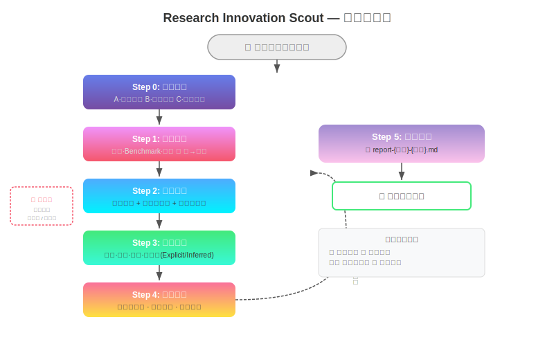

# 🔬 Research Innovation Scout

> 从模糊想法到有文献支撑的创新方向 — 把"我有个大概方向"变成"我有 N 篇论文支撑的 N 个可选选题"。

<p align="center">
  
  
  
  
  
</p>

<p align="center">
  
</p>

---

## 🚀 这是什么？

Research Innovation Scout 是一个**学科无关的科研创新点发现框架**。输入一个模糊的研究兴趣（领域、技术、关键词、论文 DOI），经过六步系统化流程，输出一份有文献锚点的决策支持报告。

每个步骤都是独立可复用的 AI 提示词，设计了防幻觉机制——**找不到证据就明确告知，绝不编造**。

### 和通用 AI 提示词的区别

| | 通用提示词 | Research Innovation Scout |
|--|-----------|--------------------------|
| 起点 | "帮我找点创新方向" | 输入分类 + 问题化引导 |
| 证据 | 凭记忆编造 | 每一步均检索真实文献/场景 |
| 分析 | 泛泛而谈 | 四维拆解 + explicit/inferred 严格区分 |
| 方向 | 随便列几个 | 四类方向 + 文献锚点 + 风险/可行性 |
| 极端场景 | 硬凑 | 冷门→明确告知无证据；热门→溢出截断 |

---

## ⚡ 快速开始

### Option 1: 一键安装（推荐）

```bash
git clone https://cnb.cool/lpk3215/research-opportunity-finder.git
cd research-opportunity-finder
./scripts/install.sh          # 自动检测工具并安装
```

### Option 2: 安装到指定工具

```bash
./scripts/install.sh --tool claude-code   # Claude Code
./scripts/install.sh --tool codebuddy     # CodeBuddy
./scripts/install.sh --tool cursor        # Cursor
./scripts/install.sh --tool copilot       # GitHub Copilot
./scripts/install.sh --tool aider         # Aider
./scripts/install.sh --tool windsurf       # Windsurf
./scripts/install.sh --tool general       # 纯 Markdown 版本
```

### Option 3: 手动使用

将 `skills/research-innovation-scout.md` 的内容发送给任意 AI（需支持文件读取和网络检索），然后输入你的研究方向。

```bash
# Claude Code 用户：克隆后 CLAUDE.md 自动生效
claude
# 然后直接说：帮我找一下"对比学习在分子性质预测中的创新方向"
```

---

## 🔌 多工具集成

Research Innovation Scout 通过 `scripts/install.sh` 支持以下工具的一键安装：

| 工具 | 安装后位置 | 使用方式 |
|------|-----------|---------|
| **Claude Code** | `~/.claude/CLAUDE.md` | `claude` 启动自动加载 |
| **CodeBuddy** | `.codebuddy/skills/research-innovation-scout/` | Skill 自动识别 |
| **Cursor** | `.cursor/rules/research-innovation-scout.mdc` | `@research-innovation-scout 输入方向` |
| **GitHub Copilot** | `.github/agents/research-innovation-scout.md` | 项目内自动生效 |
| **Aider** | `CONVENTIONS.md` | `aider` 启动自动读取 |
| **Windsurf** | `.windsurfrules` | Cascade 自动加载 |
| **通用 Markdown** | `research-innovation-scout/` | 发送给任意 AI |

### 使用示例

```
👤 用户: 帮我找一下"扩散模型在材料设计中的创新方向"

🤖 框架:
  Step 0: 输入分类 → Type A，自动推进
  Step 1: 场景校验 → 🟢 强证据（综述+benchmark+顶会）
  Step 2: 文献检索 → 18 篇核心文献池
  Step 3-4: 四维拆解 + 综合分析 → 5 个创新方向
  Step 5: 报告生成 → 📄 report-diffusion-materials-*.md
```

---

## 🏗️ 六步工作流


| 步骤 | 名称 | 做什么 | 暂停条件 |
|------|------|--------|---------|
| **Step 0** | 输入分类 | 判断 A/B/C 三种输入类型 | 类型 B/C 暂停等用户选择 |
| **Step 1** | 场景校验 | 检索综述/benchmark/顶会证据 | 无证据→终止；多场景→选择 |
| **Step 2** | 文献检索 | 种子文献 + 前后向扩展 + 筛选 | 文献<5 篇→警告 |
| **Step 3** | 四维拆解 | 问题·方法·贡献·未解决问题 | — |
| **Step 4** | 综合分析 | 开放问题池 + 方法图谱 + 四类方向 | — |
| **Step 5** | 报告生成 | 最终决策报告写入 .md 文件 | 数据自洽校验 |

### 四类创新方向

| 类型 | 说明 | 适用场景 |
|------|------|---------|
| 🔧 **深化优化** | 在现有范式内改进 | 方法有弱点或消融实验暴露缺陷 |
| 🔄 **技术迁移** | 将其他领域方法移植过来 | 问题结构相似或当前缺少某范式 |
| 🗺️ **无人区探索** | 填补方法-问题矩阵空白 | 矩阵出现 `—` 或多人指向无人解决 |
| 🔗 **问题嫁接** | 引入跨领域核心关切 | 公平性/可解释性/效率等底层问题 |

---

## 🎯 真实测试场景

| 场景 | 输入 | 结果 | 报告 |
|------|------|------|------|
| ❄️ 极冷门 | 拓扑量子化学 × 分子味觉 | ⚪ 正确终止，不编造 | [查看](reports/report-cold-topological-taste.md) |
| 🔥 极热门 | LLM for Code Generation | 667→8 篇，5 个方向 | [查看](reports/report-hot-llm-code-gen.md) |
| ⚖️ 正常 | Contrastive Learning × 分子预测 | 14 篇，6 个方向 | [查看](reports/report-medium-cl-mol.md) |

---

## 📊 统计

- 🧩 6 步完整工作流
- 📁 8 个独立 Skill 文件（任意步骤可单独使用）
- 🔬 4 类创新方向生成
- 🛡️ 4 层防幻觉机制（场景/文献/分析/方向级）
- 🌐 6+ 工具平台支持
- 📄 3 种极端场景验证通过

---

## 📁 项目结构

```
research-opportunity-finder/
├── README.md                           # 本文件
├── CLAUDE.md                           # Claude Code 自动加载
├── FRAMEWORK.md                        # 方法论设计文档
├── LICENSE                             # MIT
├── CHANGELOG.md / CONTRIBUTING.md / FAQ.md
├── scripts/
│   └── install.sh                      # 多工具一键安装
├── skills/                             # AI Skill 提示词（通用版）
│   ├── research-innovation-scout.md    # 总入口
│   ├── step-0-input-classifier.md      # 输入分类
│   ├── step-1-scene-validator.md       # 场景校验
│   ├── step-2-literature-miner.md      # 文献检索
│   ├── step-3-paper-analyzer.md        # 四维拆解
│   ├── step-4-cross-synthesizer.md     # 综合分析
│   ├── step-5-report-generator.md      # 报告生成
│   └── step-orchestrator.md            # 流程编排
├── .codebuddy/skills/                  # CodeBuddy 官方格式
├── docs/architecture.svg               # 架构图
└── reports/                            # 测试报告
```

---

## 🎨 设计哲学

1. 🔬 **防幻觉优先** — 场景需综述/benchmark 证据；文献必须真实；explicit ≠ inferred
2. 🌐 **学科无关** — 支持 CS / 医学 / 材料 / 化学等任意领域
3. 🎮 **用户可控** — 模糊输入暂停等确认；只建议不替决定
4. ⚡ **极端鲁棒** — 冷门明确终止；热门溢出截断；正常全流程

---

## 🤝 贡献

欢迎 Issue 和 PR。

- 修改 Skill 提示词：附带前后对比 + 冷/热场景测试
- 提交 Bug：提供复现步骤和期望行为
- 新增工具支持：参考 `scripts/install.sh` 添加 `install_<tool>` 函数

详见 [CONTRIBUTING.md](CONTRIBUTING.md)。

---

## 📄 更新日志

| 版本 | 日期 | 内容 |
|------|------|------|
| v1.0 | 2026-05-21 | 初始发布：完整六步框架 + 防幻觉 + 溢出处理 + 多工具安装 |

详见 [CHANGELOG.md](CHANGELOG.md)。

---

## 📜 许可证

MIT License — 自由使用。详见 [LICENSE](LICENSE)。

---

## 👤 作者

| 字段 | 信息 |
|------|------|
| 作者 | cnb.lpk |
| 邮箱 | 4tdEacxA3Uip3zcDiU1QiA+cnb.lpk@noreply.cnb.cool |
| 仓库 | https://cnb.cool/lpk3215/research-opportunity-finder |

---

⭐ Star this repo • 🍴 Fork it • 🐛 Report an issue

Made with ❤️ for researchers everywhere
